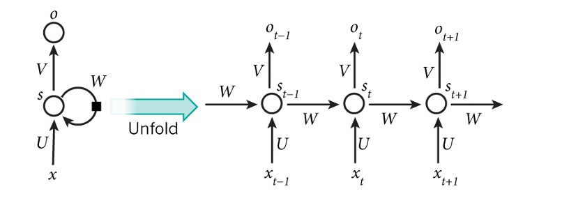
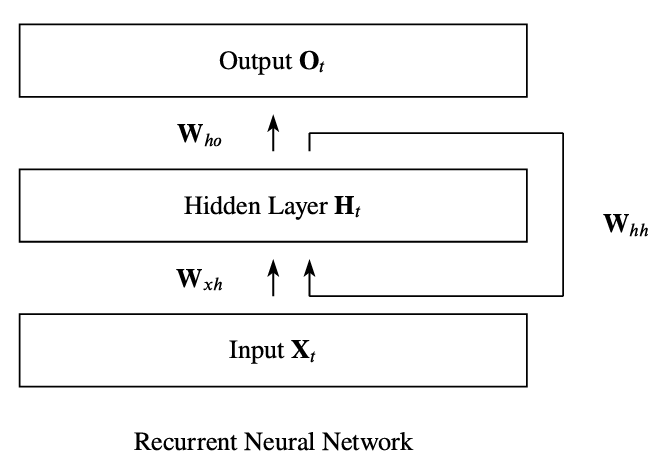

# Sequencing modeling

## Foundations

Sequencing modeling is a branch of machine learning designed to process, analyze and generate sequential data, where the order of elements matter.

For example, when a human reads and essay the order of the words carry a great deal of importance.

The main objective is to find patterns and make predictions over time.  

### Key types

- Text & Natural Language: Sentences, books, code (e.g., translation, sentiment analysis, text generation).
- Audio & Speech: Speech recognition, music generation, audio classification.
- Time Series: Stock prices, weather forecasting, sensor telemetry, medical ECGs.
- Biological Sequences: DNA, RNA, and protein structures.

## RNN

The main characteristic and the difference between MlPs (Multilayer perceptrons) is the existence of loops. 
The RNN takes into consideration the previous step $X_{0:t-1}$ and not only the current input $X_t$

Equation 1: Hidden State Update (Internal Memory)$$H_t = \phi_h\left(X_t W_{xh} + H_{t-1} W_{hh} + b_h\right)$$This equation updates the network's internal memory ($H_t$) by combining what it currently sees with what it remembers from the past.

- $X_t$ (Current Input): The input vector at time step $t$ (e.g., the current word in a sentence or current stock price).

- $H_{t-1}$ (Previous Hidden State): The memory vector carried over from the previous timestep $t-1$.

- $W_{xh}$ (Input-to-Hidden Weights): Matrix that determines how much weight to give to the new input $X_t$.

- $W_{hh}$ (Hidden-to-Hidden Weights): Matrix that determines how much weight to give to past memory $H_{t-1}$.

- $b_h$ (Hidden Bias): A learnable offset vector added to shift the activations.

- $\phi_h$ (Hidden Activation Function): A non-linear function (typically $\tanh$ or $\text{ReLU}$) that bounds the memory state and introduces non-linearity, enabling the model to learn complex patterns.

Equation 2: Output Computation (Prediction/Emission)$$O_t = \phi_o\left(H_t W_{ho} + b_o\right)$$

This equation uses the newly updated internal memory ($H_t$) to make a prediction or produce an output ($O_t$) for time $t$.

- $H_t$ (Current Hidden State): The updated memory computed in Equation 1.
- $W_{ho}$ (Hidden-to-Output Weights): Matrix that transforms the hidden representation into the dimension of the desired output.
- $b_o$ (Output Bias): A learnable offset vector for the output layer.
- $\phi_o$ (Output Activation Function): An activation function chosen based on the task:
    - Softmax: For multi-class classification (e.g., predicting the next word).
    - Logistic Sigmoid: For binary classification (e.g., positive vs. negative sentiment)
    - Identity / None: For regression (e.g., predicting continuous numeric values).

## Types of RRN's

RRN are highly know by their one-to-one relation. One entry sequence is associated with one and opnly one exit. However, they can be ajusted in a flexible way. 

- **One to many:** Uses one entry to get multiple exits. Allows linguistical aplications as imaging subtitles by generating one sentence from a keyword.
- **Many to many:** Several entries to generate multiple exists. Creating a language translator 
- **Many to one:** Several entries and only one exit value. Language translator that receives a keyword and generates a full sentence.

## References

- https://www.moveworks.com/us/en/resources/ai-terms-glossary/sequence-modeling
- https://medium.com/machine-learning-basics/sequence-modelling-b2cdf244c233
- https://aws.amazon.com/es/what-is/recurrent-neural-network/
- https://www.ibm.com/mx-es/think/topics/recurrent-neural-networks
- https://es.wikipedia.org/wiki/Red_neuronal_recurrente
- https://arxiv.org/pdf/1912.05911